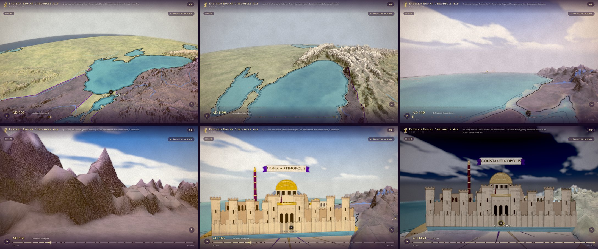

# Eastern Roman Chronicle Map · 东罗马编年地图

An interactive, bilingual (English / 中文) journey through the **Eastern Roman Empire,
AD 330–1453**. The Mediterranean world is a living chronicle map: an illuminated
manuscript you fly through freely. The mountains are sculpted and drawn in ink, the
sea is watercolour, and cities pop up out of the page. Light and weather change with
each era. The empire's borders shift across 26 snapshots in imperial purple and gold,
and 100+ bilingual events sit where they happened.



## Running

```bash
npm install
npm run dev        # dev server
npm test           # vitest: data validation + unit + component tests
npm run build      # static production build (dist/)
```

## Flying

| Input | Action |
|---|---|
| drag | look around (360°, down to the ground, up to the sky) |
| right-drag / shift-drag | move over the ground |
| wheel / pinch | fly toward the cursor |
| W A S D · Q E · arrows | move · descend/climb · look |
| N · compass | face north |
| **Begin the journey** | guided flight to Constantinople as it pops up |
| H | hide the interface |

The timeline scrubs or plays through eleven centuries (space toggles, arrows step).
Clicking an event opens its account.

URL options: `?quality=high|medium|low`, `?intro=0` (skip the opening flight), and
`?theme=painted|clockwork` for the earlier looks.

## How it works

- **World:** a Three.js scene (`src/map/three/`) built on a real DEM heightmap,
  sculpted and bent over a curved horizon, and drawn in parchment, ink and
  watercolour. See `docs/terrain-3d-spec.md` for the pipeline and
  `docs/art-direction.md` for the look.
- **Cities:** pop-up illustrations drawn procedurally on a canvas; there are no
  image assets.
- **Eras:** `src/data/moods.json` sets the light, sky, haze and colour grade per
  year, from dawn in 330 to night in 1453.
- **Territory:** a hand-authored GeoJSON MultiPolygon per snapshot, rasterized to a
  land-clipped mask and drawn as an imperial-purple glaze with a purple-and-gold
  frontier line.
- **UI:** React (header, timeline, event panel, legend, markers) over the canvas;
  zustand for the shared state.

## Editing the content (no code required)

All historical content is data, validated by zod schemas and tests:

| What | Where | Notes |
| --- | --- | --- |
| Events | `src/data/events/era*.json` | bilingual title/summary/detail, category, `[lon, lat]`, importance |
| Era snapshots | `src/data/snapshots.json` | year + bilingual label/note, sorted by year |
| Borders | `src/data/territories/<year>.json` | GeoJSON MultiPolygon; may extend over sea (only land is tinted) |
| Cities | `src/data/cities.json` | name, `[lon, lat]`, visible year range, rank |
| Era light | `src/data/moods.json` | per-year sky, light, haze and grade keyframes |
| Terrain | `scripts/assets/terrain-config.json` | straits, rivers, regions; then `npm run world:build` |

To add an event, append an object to the matching era file and run `npm test`. To
add a snapshot, add a row to `snapshots.json` **and** a matching
`territories/<year>.json`; the tests check that they pair up. Coordinates must lie
within the map bbox: lon **−12…60**, lat **24…59**.

## Regenerating the world textures

`public/terrain/*` is baked. Don't edit it by hand:

```bash
npm run world:build       # deterministic, offline (the DEM mosaic is committed)
npm run world:fetch-dem   # only if the bbox or zoom changes
```

## Stack

Vite · React 18 · TypeScript · Three.js · zustand · zod · Vitest / Testing Library.
The output is pure static files, deployable to any static host.
