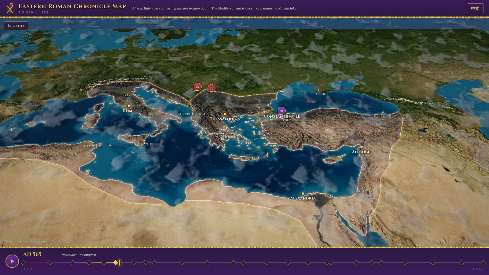
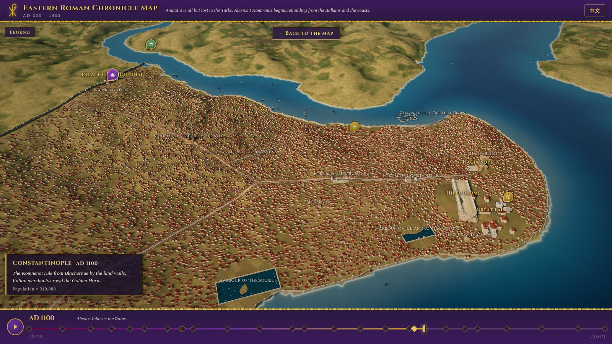

# Eastern Roman Chronicle Map · 东罗马编年地图

An interactive, bilingual (English / 中文) historical visualization of the **Eastern
Roman Empire, AD 330–1453**: a 3D map of the Mediterranean world built from real
elevation and satellite data, showing the empire's changing borders across 26 era
snapshots, with 100+ clickable event widgets covering politics, war, economy,
culture, art, law, religion, and civilization — each placed where it happened.
Zoom into **Constantinople** to walk its walls, churches and harbours as they
stood in any year from Constantine to 1453.





## Running

```bash
npm install
npm run dev        # dev server
npm test           # vitest: data validation + unit + component tests
npm run build      # static production build (dist/)
```

## How it works

- **World map** — `src/map/three/` renders a Three.js 45° god's-eye terrain:
  real-DEM relief (AWS Terrain Tiles), land colour from NASA Blue Marble (graded,
  with modern reservoirs and pivot farms painted out), close-zoom ground detail,
  animated sea, drifting clouds with their shadows, sky haze and a cinematic
  post-processing grade. Drag to pan, scroll to zoom. See
  `docs/terrain-3d-spec.md`.
- **Territory** — each snapshot year has a hand-authored GeoJSON MultiPolygon in
  `src/data/territories/<year>.json`, draped over the land as an imperial-purple
  veil with a gold frontier; snapshot changes crossfade.
- **City view** — zoom in near Constantinople (or click its name) to dive into a
  true-scale model of the city. The local terrain is baked from a high-zoom DEM;
  walls, churches, the Hippodrome, palaces, fora, harbours, houses and ships
  are generated from `src/data/cities/constantinople.json` and change with the
  timeline year: the Theodosian Walls rise in 413, Hagia Sophia burns in 532 and
  returns domed in 537, the city fills to half a million and empties to a
  "city of villages" by 1453. Right-drag or shift-drag turns the camera.
- **Events** — `src/data/events/era*.json` hold bilingual event entries (see
  schema in `src/data/schema.ts`). Events appear as clickable widgets during
  their era; clicking one stops autoplay and opens the detail panel.
- **Timeline** — scrub freely, click a snapshot diamond, or press play to sweep
  through eleven centuries (space bar toggles; arrows step).

## Editing the content (no code required)

All historical content is data, validated by zod schemas and tests:

| What | Where | Notes |
| --- | --- | --- |
| Events | `src/data/events/era*.json` | bilingual title/summary/detail, category, `[lon, lat]`, importance |
| Era snapshots | `src/data/snapshots.json` | year + bilingual label/note, sorted by year |
| Borders | `src/data/territories/<year>.json` | GeoJSON MultiPolygon; may extend over sea — only land paints |
| Cities | `src/data/cities.json` | name, `[lon, lat]`, visible year range, rank, optional `scene` |
| City views | `src/data/cities/<id>.json` | structures with year ranges and rebuild stages, urban rings, density/population curves, era captions |
| Terrain | `scripts/assets/terrain-config.json` | straits, rivers, biome regions, modern reservoirs; then `npm run world:build` |

Add an event: append an object to the matching era file, run `npm test`.
Add a snapshot: add a row to `snapshots.json` **and** a matching
`territories/<year>.json`; the tests check the pairing.

Coordinates must lie within the map bbox: lon **−12…60**, lat **24…59**.

## Regenerating the world textures

`public/terrain/*` and `public/city/*` are baked — don't edit them by hand:

```bash
npm run world:fetch-dem                     # one-time: world DEM mosaic (committed)
node scripts/fetch-dem.mjs --city constantinople   # one-time: city DEM mosaic (committed)
npm run world:fetch-imagery                 # one-time: NASA Blue Marble crop (committed)
npm run world:build                         # deterministic, offline bake of everything
```

Third-party assets and their licenses are listed in `public/ASSETS_LICENSES.md`.

## Stack

Vite · React 18 · TypeScript · Three.js · zustand · zod · Vitest / Testing Library.
Pure static output — deployable to any static host.
