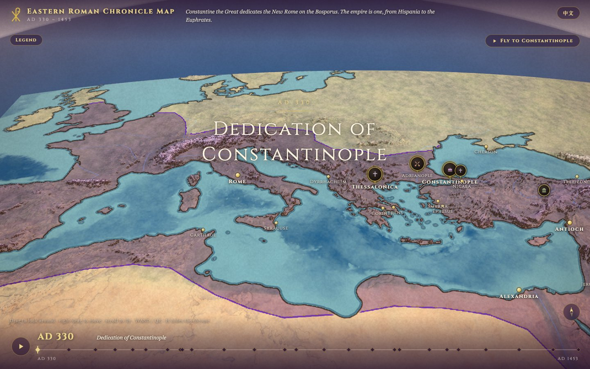
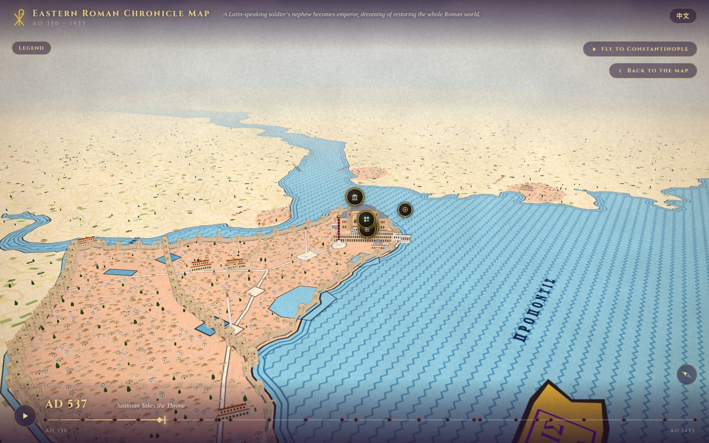
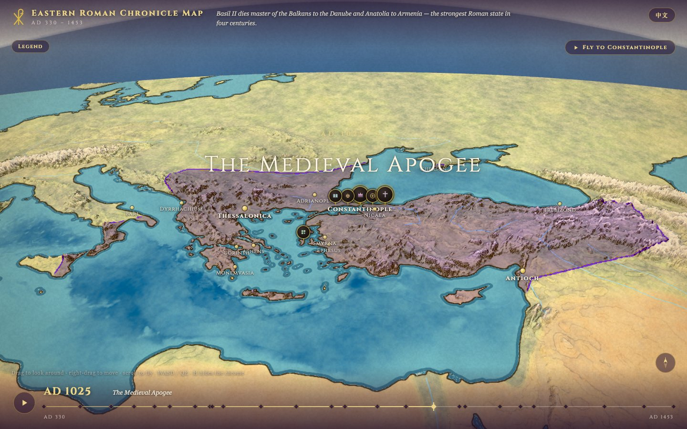
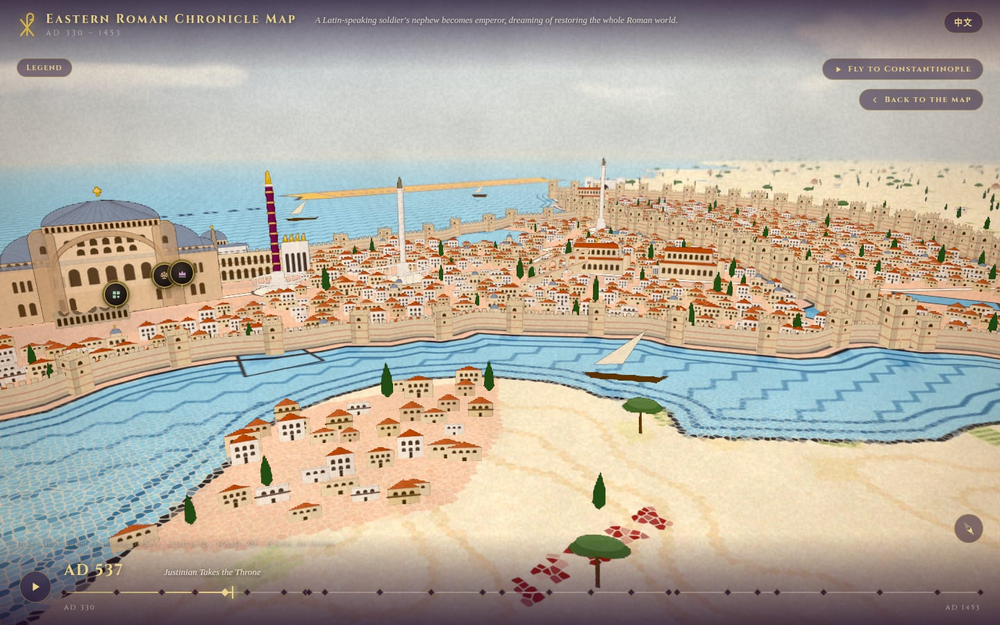

# Eastern Roman Chronicle Map · 东罗马编年地图

Eleven centuries of the **Eastern Roman Empire, AD 330–1453**, told on a map you can
fly through, in English and 中文.

The Mediterranean world is drawn as a living chronicle map, like an illuminated
manuscript come to life. Mountains rise in ink, the seas are washed in watercolour,
and the Empire's lands glow in imperial purple and gold. You are free to fly anywhere,
from high above the curve of the earth down among the mountain passes, and to follow
the Empire's story as its frontiers swell and shrink.

**Live: [eastern-roman-chronical-map.vercel.app](https://eastern-roman-chronical-map.vercel.app)**

| The continental view | The city view |
|---|---|
|  |  |
|  |  |

## Watch the centuries pass

The story opens in 330, with the whole Roman world laid out beneath you on the day
Constantine dedicates his new capital. Let time run, and the camera takes to the air
like a helicopter following the Empire. It sweeps east as the West falls away, widens
as Justinian wins back Italy and Africa, and comes down close over Anatolia and the
Balkans as the frontiers draw in. Each age announces itself as it arrives, and the
sky changes with it: a rose dawn at the founding, storms over the seventh century,
bright noon at the height of the Middle Ages, a crimson dusk when Constantinople falls
to the Crusaders, and night in 1453.

Stop anywhere to look around. Battles and sieges, church councils, law codes,
coinage and art wait where they happened, each with its own account of what took
place.

## Fly the Empire yourself

The map is yours to explore. Skim low along the Dardanelles, look up at the Taurus
from the valley floor, or climb until the whole Mediterranean curves away beneath
you. When you want a guide, a short flight carries you over the Aegean, up the
straits and down into the capital.

| Input | Action |
|---|---|
| drag | look around (360°, down to the ground, up to the sky) |
| right-drag / shift-drag | move over the ground |
| wheel / pinch | fly toward the cursor |
| W A S D · Q E · arrows | move · descend/climb · look |
| N · compass | face north |
| **Fly to Constantinople** | a guided flight over the Aegean, down into the city |
| fly low toward Constantinople · click its name | enter the city |
| climb high · **Back to the map** | leave the city |
| space · play | let time run, or stop it |
| ← → on the timeline | step through the years (shift for bigger steps) |
| H | hide the interface |

## Constantinople

From far away, Constantinople is a city like the others. Fly down to it, and you pass
through a veil of cloud into the city itself. The peninsula, the Golden Horn, Galata
and the Asian shore are laid out in their true shape as a floor mosaic, in the manner
of the 6th-century Madaba map. The Theodosian walls, Hagia Sophia, the Hippodrome, the
Great Palace, the harbours and thousands of houses stand up from the mosaic like a
pop-up book.

The city lives through time as well. Walls rise and fall, and Hagia Sophia is rebuilt,
while the view stays quietly where you left it. Climb high again, and the Empire opens
out below you once more.

## For developers

To run it locally: `npm install`, then `npm run dev`. Architecture, content editing
and the terrain bake are described in [`docs/development.md`](docs/development.md).
